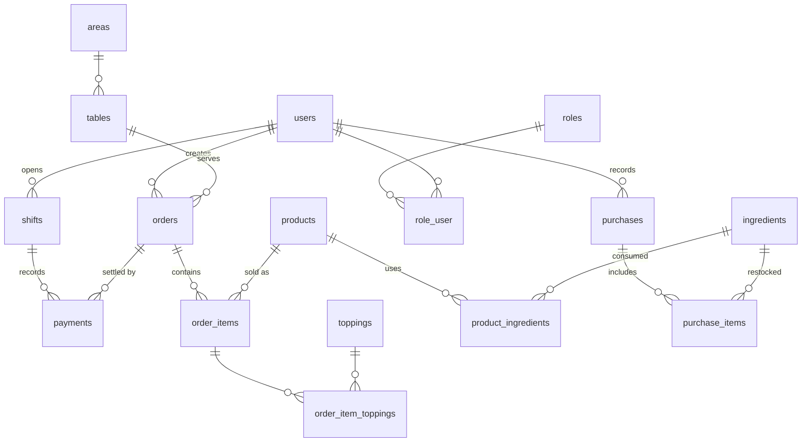

# POS Café System – Product Requirements & Data Architecture

## 1. Vision & Background
POS Café adalah platform point-of-sale terpadu untuk operasional kafe, mencakup katalog menu, bahan baku, pemesanan, pembayaran, pengelolaan shift kasir, serta pelaporan penjualan. Proyek ini dibangun di atas Laravel 11 dan Filament agar UI admin cepat dikembangkan namun tetap fleksibel. Fokus utama: menjaga alur kasir tetap ringan sambil memastikan data inventori dan penjualan konsisten.

## 2. Sasaran Produk & KPI
- **Keandalan transaksi**: 100% order berpindah status sesuai workflow (Open → Completed) ketika pembayaran lunas.
- **Akuntabilitas kasir**: Setiap pembayaran terkait shift aktif dan user pembuat order.
- **Visibilitas penjualan**: Dashboard & rekap menyediakan total penjualan harian <5 detik untuk ≤1.000 baris.
- **Kepatuhan stok**: Tiap item mengurangi stok bahan baku sesuai komposisinya.
- **Adopsi ekspor laporan**: ≥80% kasir mingguan memanfaatkan ekspor CSV.

## 3. Persona & Akses
| Persona | Tujuan | Hak Akses |
| --- | --- | --- |
| **Owner** | Melihat performa bisnis menyeluruh, audit shift, menyetujui pembelian | Semua modul + laporan global |
| **Admin** | Mengelola katalog, stok, validasi pembayaran, setup akun | Semua modul kecuali fitur owner-only (misal approval strategis) |
| **Kasir** | Mencatat order & pembayaran, melihat rekap pribadi | Modul order, payment, shift sendiri, rekap data pribadi |
| **Kitchen/Inventory** (opsional) | Update stok bahan baku, pantau bahan kedaluwarsa | Modul inventory & pembelian |

## 4. Ruang Lingkup Fungsional
### 4.1 Katalog & Inventori
- CRUD kategori, produk, topping, area, meja.
- Konfigurasi bahan baku (`ingredients`) beserta relasi `product_ingredients` untuk konsumsi otomatis.
- Notifikasi stok & bahan kedaluwarsa (via widget/notification table).
- Modul pembelian (`purchases`) untuk restok + item detail.

### 4.2 Pemesanan & Pembayaran
- Order builder dengan dukungan topping, diskon, service fee, catatan.
- Validasi stok sebelum order disimpan.
- Pembayaran multi-metode (cash, QRIS, transfer, ewallet) + pencatatan kembalian.
- Pengiriman struk via WhatsApp.

### 4.3 Shift Kasir
- Pembukaan/tutup shift mencatat saldo awal/akhir, total penjualan, dan catatan kasir.
- Pembayaran harus dikaitkan dengan shift aktif untuk kasir non-admin.

### 4.4 Pelaporan & Analitik
- Dashboard widgets: sales chart, top orders, stok kedaluwarsa, penjualan per kasir/shift.
- Halaman Rekap Penjualan dengan filter harian, mingguan (7 hari), bulanan (30 hari), serta custom range; ekspor CSV mengikuti scope user.

### 4.5 Sistem & Lokalization
- Middleware bahasa berbasis session; dukungan multi-locale untuk UI & format tanggal uang.
- Role & permission granular menggunakan tabel `roles` dan pivot `role_user`.

## 5. Alur Pengguna Inti
1. **Kasir buka shift** → saldo awal dicatat.
2. **Kasir membuat order** → pilih meja/jenis order, tambahkan item+topping, sistem cek stok.
3. **Order dikirim ke dapur** (melalui card/list view) → kitchen menyiapkan.
4. **Kasir memproses pembayaran** → pilih metode pembayaran, jumlah bayar, sistem otomatis set status order Completed dan log ke shift.
5. **Kasir menarik laporan** → gunakan rekap untuk melihat total pribadi atau ekspor ke CSV.
6. **Admin/owner review** → dashboard & rekap memperlihatkan agregasi lintas kasir/shift, serta stok & pembelian.
7. **Inventory restok** → admin membuat purchase order, stok bahan baku bertambah.

## 6. Kebutuhan Fungsional
### 6.1 Order & Payment
- Order harus menyimpan `user_id`, `table_id`, `order_type`, subtotal, diskon, service fee, total, status dan catatan.
- Order items menyimpan link produk, qty, harga, diskon per item, subtotal.
- Topping tersimpan di `order_item_toppings` dengan harga dan referensi topping master.
- Pembayaran wajib memiliki `payment_date`, `shift_id`, `payment_method`, `amount_paid`, `change_return`.
- Status log tersimpan di `order_status_logs` setiap terjadi perubahan status.

### 6.2 Shift Management
- Shift mencatat `shift_open_time`, `shift_close_time`, `opening_balance`, `closing_balance`, `total_sales`, `notes`.
- Validasi saat kasir mencatat order/pembayaran: harus ada shift aktif.

### 6.3 Inventory & Purchasing
- Ingredients memuat stok, unit, harga per unit, tanggal kedaluwarsa.
- `product_ingredients` menentukan konsumsi bahan (qty, unit) per produk.
- Purchase mencatat invoice, tanggal beli, user, total; `purchase_items` detail ingredient, qty, harga/unit.
- Stock mutation & product stock tables merekam perubahan historis.

### 6.4 Reporting
- Dashboard widget menarik data Payment & Order terfilter role.
- Rekap Penjualan menerapkan filter timeframe + custom range, summary KPI, list transaksi, summary per kasir, ekspor CSV chunked agar hemat memori.

### 6.5 Admin Settings
- `settings` table menampung flag seperti `manage_stock_enabled`.
- Locale middleware menyimpan preferensi bahasa dalam session.

## 7. Non-Fungsional
- **Performa**: Render daftar/rekap <5 detik untuk 1.000 row; ekspor stream agar memory tetap rendah.
- **Keamanan**: Role-based guard di Filament, data kasir dibatasi user-nya.
- **Auditability**: Shift + status log memastikan trail lengkap.
- **Reliability**: Semua operasi kritikal diuji via PHPUnit (order topping flow, widgets, locale, shift rules, payment receipts).
- **Usability**: UI Filament menampilkan card/list switch, search, filter interaktif.

## 8. Implementation Notes & Roadmap
1. **MVP**: CRUD katalog, order, payment, shift, laporan dasar.
2. **Inventory Advanced**: Ingredients, automatic deduction, notifications.
3. **Reporting Enhancements**: Custom range, cashier recap, exports.
4. **Future Ideas**: PDF/Excel export, loyalty program, multi-branch.

## 9. Database Architecture
### 9.1 Daftar Entitas
- **users**: akun sistem.
- **roles** & **role_user**: kontrol akses.
- **areas**, **tables**: zonasi dan meja.
- **categories**, **products**, **toppings**, **ingredients**, **product_ingredients**.
- **orders**, **order_items**, **order_item_toppings**, **order_status_logs**.
- **payments**, **shifts**.
- **purchases**, **purchase_items**.
- **settings**, **notifications**, **activity_logs**, **product_stocks**, **stock_mutations** (penunjang).

### 9.2 Detail Struktur
#### users
- Kolom kunci: `name`, `email`, `password`, `is_active`, `is_guest`, timestamps + soft deletes.
- Relasi: hasMany `orders`, `shifts`, `purchases`; belongsToMany `roles`.

#### roles & role_user
- `roles`: `name`, `guard_name`.
- `role_user`: pivot `user_id`, `role_id` (many-to-many).

#### areas & tables (cafe_tables)
- `areas`: `name`, `description`, `status_enabled`.
- `tables`: `area_id`, `table_number`, `status`.
- Relasi: area hasMany tables; table belongsTo area; orders optional belongsTo table.

#### categories & products
- `categories`: `name`, `description`, `status_enabled`.
- `products`: `category_id`, `name`, `sku`, `price`, `cost_price`, `stock_qty`, `description`, `status_enabled`.
- Relasi: category hasMany products; product hasMany order_items; product hasMany product_ingredients; product hasMany toppings via order items.

#### ingredients & product_ingredients
- `ingredients`: `name`, `stock_qty`, `unit`, `price_per_unit`, `expired` (date), soft deletes.
- `product_ingredients`: `product_id`, `ingredient_id`, `quantity_used`, `unit`.
- Digunakan untuk kalkulasi stok otomatis.

#### toppings & order_item_toppings
- `toppings`: `name`, `price`, `is_active`.
- `order_item_toppings`: `order_item_id`, `topping_id`, `price`.
- Relasi: order_item hasMany toppings; topping referenced oleh banyak order item.

#### orders & order_items
- `orders`: `user_id`, `table_id`, `order_type` (enum dine_in/take_away/delivery), `customer_name`, `status`, `subtotal_order`, `discount_order`, `service_fee_order`, `total_order`, `notes`, timestamps.
- `order_items`: `order_id`, `product_id`, `qty`, `price`, `discount_amount`, `subtotal`.
- `order_status_logs`: `order_id`, `status`, `description`, timestamps untuk histori.
- Relasi: order belongsTo user & table; hasMany items, payments, statusLogs.

#### payments
- Kolom: `order_id`, `shift_id`, `payment_method` (cash/qris/transfer/ewallet), `amount_paid`, `change_return`, `payment_date` + timestamps.
- Relasi: belongsTo order & shift; order hasMany payments; shift hasMany payments.

#### shifts
- Kolom: `user_id`, `shift_open_time`, `shift_close_time`, `opening_balance`, `closing_balance`, `total_sales`, `notes` + soft deletes.
- Relasi: belongsTo user; hasMany payments.

#### purchases & purchase_items
- `purchases`: `user_id`, `invoice_number`, `purchase_date`, `total_amount`, `notes`.
- `purchase_items`: `purchase_id`, `ingredient_id`, `quantity`, `unit`, `price_per_unit`.
- Relasi: purchase belongsTo user; hasMany purchase_items; purchase_item belongsTo ingredient.

#### settings, notifications, logs
- `settings`: key-value config (mis. `manage_stock_enabled`).
- `notifications`: Filament notifications table.
- `activity_logs`, `product_stocks`, `stock_mutations`: menyimpan histori aktivitas & stok.

### 9.3 ERD (Tekstual + Mermaid)
Relasi utama:
- User ↔ Role (many-to-many via role_user).
- User 1—* Shift 1—* Payment *—1 Order.
- Order 1—* OrderItem 1—* OrderItemTopping *—1 Topping.
- Product 1—* OrderItem; Product 1—* ProductIngredient *—1 Ingredient.
- Area 1—* Table *—1 Order.
- Purchase 1—* PurchaseItem *—1 Ingredient.

### 9.4 Data Flow Catatan Penting
- `payment_date` digunakan sebagai sumber waktu utama laporan; fallback ke `created_at` bila null.
- Shift scope: kasir hanya melihat pembayaran/rekap jika `shift.user_id` atau `order.user_id` = dirinya.
- Custom range reporting menghormati filter `range_start` / `range_end` yang disimpan di state halaman Filament.
- Ekspor CSV dilakukan via stream + chunk 500 row untuk menghindari memory spike.

## 10. Risiko & Mitigasi
- **Konsistensi stok**: Pastikan hook pengurangan stok dijalankan setelah order Completed. Tambah test untuk scenario stok rendah.
- **Shift tidak aktif**: Guard middleware perlu memastikan kasir tidak membuat order/pembayaran tanpa shift. Tes sudah menutup kasus utama.
- **Performa laporan**: Gunakan eager loading (`with`) & index pada kolom `payment_date`, `user_id`.
- **Multilanguage**: Validasi bahwa teks baru mengikuti file translation.

## 11. Next Steps
- Tambah ekspor PDF/Excel sesuai roadmap.
- Pertimbangkan multi-tenant/branch (butuh kolom `branch_id`).
- Integrasi hardware (printer kasir, scanner) bila diperlukan.
